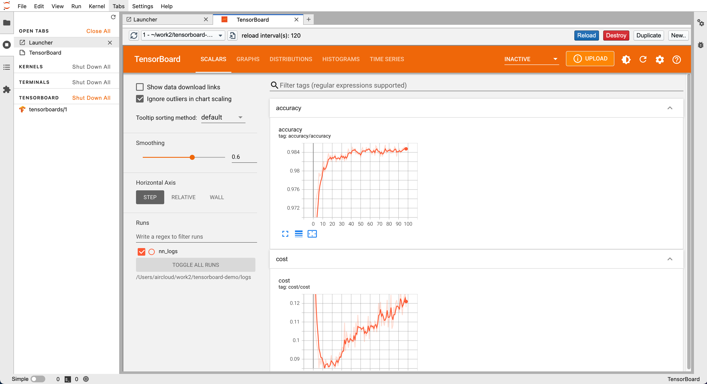

# JupyterLab-TensorBoard-Pro

&nbsp;[](https://pypi.org/project/jupyterlab-tensorboard-pro/)

一个更加完善的 TensorBoard JupyterLab 插件



## 依赖

**python >= 3.6**

请在安装本项目之前安装以下依赖：

- jupyterlab
- tensorflow
- tensorboard

## 安装

```
pip install jupyterlab-tensorboard-pro
```

> 这是一个 jupyterlab 插件，目前已经不在支持 jupyter notebook

## 开发背景

实际上，目前社区里面已经有了[jupyterlab_tensorboard](https://github.com/chaoleili/jupyterlab_tensorboard)（前端插件）和 [jupyter_tensorboard](https://github.com/lspvic/jupyter_tensorboard)（对应的后端插件），不过两个仓库都已经很久没有更新，对于一些新的修复 PR 也没有及时合入，基于此判断项目作者已经不在积极地维护对应仓库。

同时，现有社区的 TensorBoard 插件存在一定的体验问题，比如需要同时安装两个 python 包，以及点击之后无任何响应，无法设置 TensorBoard Reload 时间等问题，交互体验不够友好，也会影响用户的 JupyterLab 使用体验。

因此本项目 fork 了社区现有项目，对逻辑进行更改，并且参考了之前一些比较有帮助但是暂时没有合入的 PR，希望能够在接下来较长的一段时间持续维护。

这个项目对接口名也进行了更改，因此可以和上述插件保持完全的独立。

特别感谢之前相关仓库的开发者们。

## 使用说明

### 创建实例

#### 从 launcher 面板创建

我们可以从 Launcher 面板点击 TensorBoard 图标，首次点击会进入到一个默认的初始化面板，我们可以从该面板创建 TensorBoard 实例。非首次进入则会直接进入到第一个活跃的 TensorBoard 实例。


#### 通过快捷命令创建

我们也可以在 JupyterLab 快捷指令面板（`ctrl + shift + c` 唤起）中输入 `Open TensorBoard`。


#### 创建参数

在初始化面板中，提供了两个参数设置项目：

- **Log Dir**：默认是点击 TensorBoard 时当前侧边栏的目录，也可以手动填写对应目录，这里建议目录尽可能的细化，目录内容比较少的话会提高初始化速度。
- **Reload Interval**：TensorBoard 多久对对应目录进行一次重新扫描，这个选项是默认是 120s，但是如果不需要建议及时关闭，日常使用选择手动 Reload 即可（设置 Reload Interval 之后，TensorBoard 后端持续扫描目录会对 Jupyter 的稳定性和文件系统都产生一定的影响）。

选择好参数点击 Create TensorBoard，会同步创建 TensorBoard 实例，这个时候 jupyter 后端是**阻塞**的，请等待实例创建好之后再进行其他操作。


### 管理实例

创建实例后，我们可以对 TensorBoard 的实例进行管理，目前依次提供了以下几个功能：

- **刷新和列表切换**：可以切换成其他的实例的 TensorBoard 后端，这个时候不会销毁实例。
- **独立页面中打开**：可以在以独立网页 Tab 的形式打开 TensorBoard。
- **Reload**：即重新初始化 TensorBoard 后端，当文件内容有更新时，可以通过此功能载入新的内容（注：TensorBoard 内部的刷新，不会造成 Reload）。
- **Destroy**：销毁实例，会连同前端面板一起关掉。
- **Duplicate**：重新打开一个完全一样的前端面板，此操作会复用 TensorBoard 后端。
- **New**：额外新建一个 TensorBoard 后端，注意事项可以参考上文。

另外，对于我们创建的 TensorBoard 实例，可以在 Jupyter 的 Kernel 管理面板一同管理，提供跳转至对应实例和删除等功能。


### 使用 AWS S3

> 这里假设你已经对 aws s3 有了一定的使用经验

TensorBoard 支持通过 `s3://path/to/dir` 的方式传入一个 s3 的路径，这个方式在本插件内也同样支持。

不过，因为 s3 的路径通常并不是直接可以访问的，需要先通过 `aws configure` 配置一些基本信息（[下载](https://docs.aws.amazon.com/cli/latest/userguide/getting-started-install.html) aws cli），通常情况下，JupyterLab 运行所在的系统应该有以下文件：

```shell
# ~/.aws/config
[default]
region = ap-southeast-1
output = json

# ~/.aws/credentials
[default]
aws_access_key_id = ********
aws_secret_access_key = ********
```

然后你需要额外安装一些依赖：

```
pip install botocore boto3 tensorflow-io
```

之后你可以输入一个 s3 路径，然后点击 tensorboard 的刷新按钮，等待加载完成后即可展示：


> 实际上，现在 tensorboard 本身在这里的状态提示并不友好，后续我们会进一步调研有没有更好的体验的方式

## 调试

你可以通过 `jupyter-lab --debug` 开启 JupyterLab 和 TensorBoard 的调试日志。

## 本地开发

```shell
jlpm install
pip install jupyter_packaging
jlpm run install:client
jlpm run install:server
# after above maybe you need create use a soft link to hot update
```

前端部分开发：

```
jlpm run watch
```

后端部分可以在设置软链接之后，直接修改 python 文件，重启生效。

打包:

```
python setup.py bdist_wheel --universal
```

一般情况下提交 MR 即可，本项目的开发者可以打包发布到 pypi。
